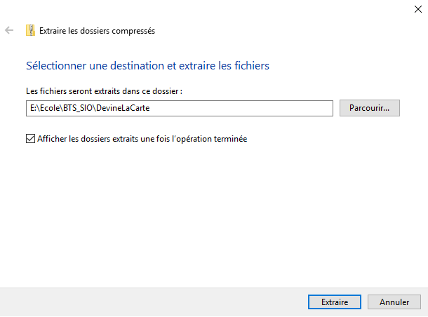

= DevineLaCarte
:author: Quentin AYRAL, Mathieu MORGADO MARTA et Sekou TRAORE
:docdate: 2022-10-11
:asciidoctor-version:1.1
:description: Projet pédagogique d'initiation à Kotlin

== Thème

Développer une logique de jeu mettant en œuvre de la conception objet et des tests unitaires.

Jeu en mode console. L'Implémentation est donnée (`MainPlayConsole.kt` en interaction en mode console/terminal)

'''

== Challenge-1 : Prise en main et tests unitaires

=== Vérification des prérequis du système

* Vérification du fonctionnement de `git` sur le système avec la commande : `git --version` sur le terminal
+

* Vérification du fonctionnement de l'IDE IntelliJ IDA.
+

=== Prise en main du projet de démarrage

Clonage du projet sur l'IDE, mais sans utiliser le lien `https://gitlab.com/sio-labo/devinelacarte.git, et le dossier racine cible` car le dossier complet n'est pas fonctionnel sur les systèmes du lycée.

=== Lancement des tests unitaires

Apres avoir fait `Run Tests in org.sio.slam.devine`

On peut lire que 4 tests unitaires ne sont pas passés. Ce sont :

* `fabriqueDe52Cartes()`
* `fabriqueDe32Cartes()`
* `compareCartesDeCouleurDifferenteMaisDeMemeValeur()`
* `testGetCartes()`

//add runPremiersTest
image::runPremiersTests.PNG[]

=== Faire passer les tests unitaires

Pour `fabriqueDe52Cartes()` nous avons fait un test qui vérifie si notre paquet de carte contient bien 52 cartes :

----
    @Test
    fun fabriqueDe52Cartes() {
        val test = Paquet(createJeu52Cartes())
        assertEquals(52, test.cartes.size)
    }
----
Pour `fabriqueDe32Cartes()` nous avons fait un test similaire tout en vérifiant que la première carte du paquet était bien un "SEPT" :

----
    @Test
    fun fabriqueDe32Cartes() {
        val test = Paquet(createJeu32Cartes())
        assertEquals(32, test.cartes.size)
        assertEquals(NomCarte.SEPT,test.cartes[0].nom)
    }
----
Pour réaliser les tests de fabrication du paquet, nous avons réalisé une boucle imbriquée dans la classe `FrabriqueJeuDeCartes.kt` lors de la fabrication du paquet de carte afin d'éviter de rajouter les cartes une à une dans le paquet en dur comme ci-dessous, tout en s'assurant que les valeurs de deux à six ne soient pas créées dans le paquet de 32 cartes :

* `FrabriqueJeuDeCartes()`

----
fun createJeu32Cartes() : List<Carte> {
    var listeCartes: MutableList<Carte> = mutableListOf()

    for (couleur in CouleurCarte.values()) {
        for (nom in NomCarte.values()) {
            when (nom.toString()) {
                "DEUX", "TROIS", "QUATRE", "CINQ", "SIX" -> continue
                else -> listeCartes.add(Carte(nom,couleur))
            }
        }
    }
    return listeCartes
}

fun createJeu52Cartes() : List<Carte> {
    var listeCartes: MutableList<Carte> = mutableListOf()
    for (couleur in CouleurCarte.values()) {
        for (nom in NomCarte.values()) {
            listeCartes.add(Carte(nom, couleur))
        }
    }
    return listeCartes
}
----

Pour `testGetCartes()`, il fallait implémenter un accesseur de cartes :

----
    @Test
    fun testGetCartes() {
        val paquet2Cartes = Paquet(listOf(
            Carte(NomCarte.VALET, CouleurCarte.COEUR),
            Carte(NomCarte.DIX, CouleurCarte.TREFLE),
        ))
        var test: List<Carte> = paquet2Cartes.cartes
        assertEquals(NomCarte.VALET,test[0].nom)
        assertEquals(CouleurCarte.COEUR,test[0].couleur)
    }
----

* Enfin pour `compareCartesDeCouleurDifferenteMaisDeMemeValeur()` nous avons attribué des valeurs aux "couleurs" des cartes dans *CouleurCarte.kt* de manière totalement arbitraire et simplement dans l'ordre qui était présent :
----
enum class CouleurCarte(val points: Int) {
    TREFLE(1),
    PIQUE(2),
    CARREAU(3),
    COEUR(4)
}
----
* Puis nous avons vérifié que cela était fonctionnel via le test CartesDeCouleurDifferenteMaisDeMemeValeur()
----
     @Test
     fun compareCartesDeCouleurDifferenteMaisDeMemeValeur()  {
        val roiDePique : Carte = Carte(NomCarte.ROI, CouleurCarte.PIQUE)
        val roiDeCoeur : Carte = Carte(NomCarte.ROI, CouleurCarte.COEUR)
        val roiDeCarreau : Carte = Carte(NomCarte.ROI, CouleurCarte.CARREAU)
        val roiDeTrefle : Carte = Carte(NomCarte.ROI, CouleurCarte.TREFLE)
        assertTrue(roiDePique < roiDeCoeur && roiDeCarreau > roiDeTrefle)
----

'''
== Challenge-2 : Jouer avec le jeu

Lancement du jeu (En mode console-terminal) : Nous avons `Run MainPlayConsole` et avons attendu que la compilation opère et interagit avec le programme en testant plusieurs valeurs de cartes.

=== Représentation de l'algorithme initial de la fonction `main`

Représentation de l'algorithme implémenté par la fonction `main`.

[plantuml]
-----
@startuml
!pragma useVerticalIf on
title Diagramme d'activité 1

start

:Création du paquet
Instanciation du jeu;

:Donner un nom de carte
Donner une couleur de carte;

if (Définition couleur et nom) then (Pas Bon)
    :Erreur et affichage de
          la carte donnée;

else (Bon)
    if (Carte devinée) then (oui)
        :affichage de la carte
                à deviner;
    else (non)
endif
endif
:fin de la partie;
stop
@enduml
-----

=== Implémentation des TODOs

Les TODOs ont été implémentés dans la classe `MainPlayConsole`

Voici le code qui a été écrit :

----
    // TODO (A) demander au joueur s'il souhaite avoir de l'aide pour sa partie

    var aide = false
    println("Voulez-vous de l'aide ? [Oui/Non]")
    if(readLine().toString().uppercase().startsWith("OUI")) aide = true
    if(aide) println("L'aide a été activée")
    if(!aide) println("L'aide n'a pas été activée")
----
----
    // TODO (A) demander au joueur avec quel jeu de cartes 32 ou 52 il souhaite jouer
    val rep = readLine()
    var paqueDeCartes = Paquet(createJeu32Cartes())
    if(rep =="52") paqueDeCartes = Paquet(createJeu52Cartes()) else if(rep=="32") paqueDeCartes = Paquet(createJeu32Cartes())
----
----
    // TODO: (A) si l'aide est activée, alors dire si la carte proposée est plus petite ou plus grande que la carte à deviner
    if (aide) {
        when (couleurCarteUser.compareTo(jeu.carteADeviner.couleur)){
            0 -> println("La couleur est la bonne, ")
            in 1..Int.MAX_VALUE-> println("La couleur de la carte à trouver est plus petite\nRappel : Coeur > Carreau > Pique > Trefle")
            in Int.MIN_VALUE..-1 -> println("La couleur de la carte à trouver est plus grande\nRappel : Coeur > Carreau > Pique > Trefle")
        }
        when (nomCarteUser.compareTo(jeu.carteADeviner.nom)){
            0 -> println("La valeur de la carte est bonne.")
            in 1..Int.MAX_VALUE -> println("La valeur à trouver est plus petite.")
            in Int.MIN_VALUE..-1 -> println("La valeur à trouver est plus grande.")
    }

----
----
    // TODO (A) Présenter à la fin la carte à deviner
    val pronom = when (carteTiree.nom) {
        NomCarte.DAME -> "la "
        NomCarte.AS -> "l'"
        else -> "le "
    }
    val prcentReussite = ((reussite.toDouble()/tenta.toDouble())*100)
    println("La carte à deviner était $pronom${carteTiree.nom} de ${carteTiree.couleur}, vous avez eu ${String.format("%.2f",prcentReussite)}% de réussite")
----
* Pour le TODO suivant, une variable `reussite` ainsi que `restart` ont été utilisées, toutes les deux sont initialisées à 0, `reussite` est incrémentée lorsque le joueur trouve la bonne carte afin de ne pas avoir la question "Voulez-vous abandonner ? [Oui/Non]", `restart` est elle incrémentée soit lorsque l'utilisateur trouve la bonne carte, soit quand l'utilisateur souhaite abandonner ce dernier, dans les deux cas, l'action recherchée est la sortie du jeu :
----
    // TODO (A) permettre au joueur de retenter une autre carte (sans relancer le jeu) ou d'abandonner la partie
        if(reussite==0){
            println("Voulez-vous abandonner ?")
        }
        val answer = readLine()?.uppercase()
        if(answer == "OUI"){
            abandon = true
            restart++
        }
    }while(restart != 1)
----
----
// TODO (optionnel) permettre de saisir un chiffre au lieu d'une chaine : 7 au lieu de Sept...
        val nomCarteUserStr: String = readLine() + ""
        val nomCarteUser: NomCarte? =
            if (nomCarteUserStr in (2..10).toSet().toString()) {
                val words = arrayOf("deux", "trois", "quatre", "cinq", "six", "sept", "huit", "neuf", "dix")
                val nomCarteUserInt = nomCarteUserStr.toInt()
                val result = words[nomCarteUserInt - 2]
                getNomCarteFromString(result.trim().uppercase())
            } else
                getNomCarteFromString(nomCarteUserStr.trim().uppercase())
----

=== Représentation algorithme de la fonction `main` nouvelle version

Représentation sous la forme d'un diagramme d'activité rédigé en `plantuml` de la nouvelle version de l'algorithme de la fonction `main`.

[plantuml]
----

@startuml
title : Diagramme d'activité 2
start
:Demander si activation de l'aide
Demander taille jeu de cartes;

:Création du paquet
Instanciation du jeu;

repeat :Donner un nom de carte \nDonner une couleur de carte ;
if (aide) equals (true) then
:Donner Indice couleur
Donner Indice nom;
else (false)
endif
if (Carte dans paquet) then (true)
    if (Carte donnée) then (true)
        :trouvé;
        break
    else (false)
    endif
endif

repeat while (recommencez) is (true)
:affiche la carte à deviner;
:afficher la strategie;
:fin de la partie;
stop
@enduml

----

'''
== Challenge-3 : Rebattre les cartes

Nous avions pour objectif de rebattre les cartes, c'est-à-dire mélanger le paquet de carte pour que les valeurs ne soient pas rangées dans l'ordre, mais soient dans le désordre, pour cela vous avons :

. Ajout d'une méthode nommée `melange()` dans `Paquet.kt`
qui _rebat les cartes du paquet_

. Lancement d'un test unitaire appelé `melangeDeCartes` dans `PaquetTest` pour _vérifier si le paquet à bien été mélangé et qu'il est différent de l'ancien_

*Voici le code ajouté :*
====
*Dans* `Paquet.kt`
nous avons ajouté :
----
fun melange(): Unit = shuffle(cartes)
----
Puis dans
`PaquetTest` on a ajouté, il y a effectivement :
----
@Test
fun melangeDeCartes(){
    val test = Paquet(createJeu52Cartes())
    assertEquals("DEUX",test.cartes[0].nom.toString())
    test.melange()
    assertNotEquals("DEUX",test.cartes[0].nom)
}
----

====

'''

== Challenge-4 : La stratégie du joueur

Nous avions pour objectif d'analyser la stratégie du joueur et de lui communiquer à la fin de sa partie. Elle s'appuie sur sa façon de raisonner, s'il a fait de façon linéaire ou de façon dichotomique. Tout le code pour analyser la stratégie sera ajouté dans la class `Jeu` et affiché à la fin de la partie  dans `MainPlayConsole`.

L'analyse de la stratégie du joueur, se lance quand le joueur termine sa partie, elle s'appuie sur des paramètres de la partie (le nombre de cartes, si l'aide a été activée ou non).

Voici les éléments qu'on prend en compte lors de l'analyse :

. Le nombre d'essais qu'il a fait pour trouver la carte
. S'il est passé par une méthode *linéaire* (aide désactivée)
+
(Le principe est savoir s'il a rentré les cartes une à une ou bien au hasard et s'il a eu de la chance, lui informer, _en trouvant du premier coup par exemple._)

. S'il est passé par une méthode de *dichotomie* (aide activée)
+
(Le principe est de l'aider en faisant le nombre de coups *minimum* pour gagner, sans passer par le hasard ou la triche.)

*Voici le code ajouté :*
====
*Dans* `Jeu.kt`

on a ajouté :
----
fun strategiePartie(nbEssais : Int, restart: Boolean): String {
        if(!restart){
            if(avecAide){
                val dichoSearch : Double = log2(paquet.cartes.size.toDouble())
                if(nbEssais.toDouble() >= dichoSearch*1.80){
                    return "Avec votre recherche dichotomique peu précise, vous avez fais $nbEssais essais"
                }
                else if (nbEssais.toDouble() >= dichoSearch +1 && nbEssais.toDouble() < dichoSearch*1.80){
                    return "Avec votre recherche dichotomique assez précise, trouvé $nbEssais essais"
                }
                else if (nbEssais == dichoSearch.toInt()) {
                    return "Avec votre recherche dichotomique très précise, trouvé en $nbEssais essai(s)"
                }
                else{
                    return "Peu de stratégie sûrement de la chance, trouvé en $nbEssais essai(s)"
                }
            }
            else{
                val pourcentChance : Double = (nbEssais.toDouble() / paquet.cartes.size.toDouble())*100.0
                return if (nbEssais / paquet.cartes.size <= 0.25){
                    "Avec une stratégie linéaire, vous aviez ${pourcentChance.toInt()}% de chance de trouver, vous avez $nbEssais essais"
                }
                else{
                    "Avec une stratégie linéaire, vous aviez ${pourcentChance.toInt()}% de chance de trouver, vous avez $nbEssais essais"
                }
            }
            return "Erreur"
        }
        else{
            return "Pas de stratégie, vous avez abandonné"
        }
    }
----
*Puis dans*
`src.main.*kotlin*.org.sio.slam.devine.MainPlayConsole`,
On a ajouté :
----
println(jeu.strategiePartie(tenta,abandon))
----

====

== Compte rendu : Les depots Gitlab à consulter

* Le depot initial :  https://gitlab.com/sio-labo/devinelacarte.git

* Notre depot : https://gitlab.com/MorgadoMathieu/projet0